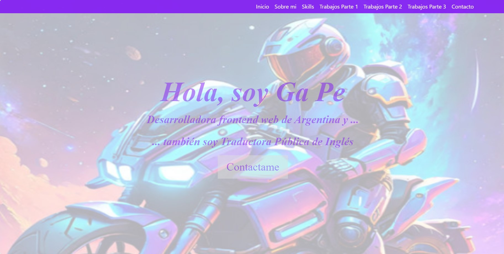

✋Hola soy Gaby
- 🌱 Esta es una mejora de mi primer trabajo sola de Front End y que subo a Github (me costó bastante!!) 😥
- Lo estructuré poniendo una foto como fondo de pantalla y presentación.
- Luego algunos datos Sobre Mi (😉)
- En la siguiente sección Skills, mencioné con lo que trabajé.
- Posteriormente dividí mi primera presentación en 3 secciones con algunos cambios en la distribución y estilo, pero manteniendo lo que hice.
- Y finalmente la sección de Contacto con un footer con las redes sociales.
- Acá algunas pantallas de muestra: 

- Gracias por leer mi trabajo.  
